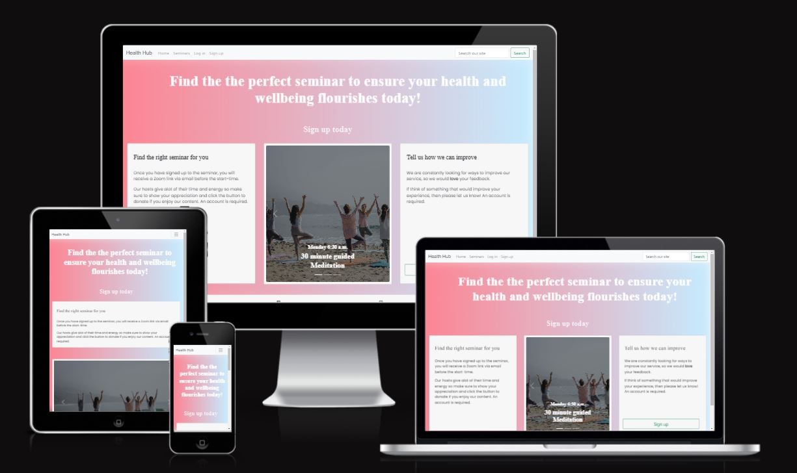

# [Health Hub](https://wellness-site.herokuapp.com/)



HealthHub is an app designed for a person or group of people who want to run health and wellness seminars. This app provides users with an easy way to locate and attend suitable virtual seminars. This provides hosts with a simple way to see who is attending their seminars, and also allows customers an option to donate and support their favoured host.

## Table of Contents
* [User Experience Design (UX)](#User-Experience-Design)
    * [The Strategy Plane](#The-Strategy-Plane)
        * [Site Goals](#Site-Goals)
        * [Agile Planning](#Agile-Planning)
          * [Epics](#Epics)
          * [User Stories](#User-Stories)
    * [The Scope Plane](#The-Scope-Plane)
    * [The Structure Plane](#The-Structure-Plane)
      * [Features](#Features)
    * [The Skeleton Plane](#The-Skeleton-Plane)
        * [Wireframes](#Wireframes)
        * [Database Design](#Database-Design)
    * [The Surface Plane](#The-Surface-Plane)
        * [Design](#Design)
            * [Colour Scheme](#Colour-Scheme)
            * [Typography](#Typography)
            * [Imagery](#Imagery)
* [E-Commerce](#E-Commerce)
    * [E-Commerce Model](#E-Commerce-Model)
    * [Facebook Business Page](#Facebook-Business-Page)
* [Technologies](#Technologies)
* [Testing](#Testing)
* [Deployment](#Deployment)
    * [Version Control](#Version-Control)
    * [Heroku Deployment](#Heroku-Deployment)
    * [Run Locally](#Run-Locally)
    * [Fork Project](#Fork-Project)
* [Credits](#Credits)
  * [Content](#Content)
  * [Acknowledgements](#Acknowledgements)
---

# User-Experience-Design

## The-Strategy-Plane

### Site-Goals

This website's aim is to help users easily locate and attend suitable health and wellbeing seminars. It allows the user to engage with the community by commenting and replying on a seminar. It also allows users to donate and support a seminar if they felt it was worthwhile.

This website also aims to provide the hosts with an easy way to attract new attendees and grow their user base. It allows them to track who is attending so they can email out links to seminars.

### Agile Planning

I developed this project using Agile methodologies such as epics and user stories to create the site in small individual pieces. I have broken the user stories into 5 epics. I used a trello KanBan board to track my progress. You can [click here](https://trello.com/b/zEb1zeOL/project-5) to view the KanBan board.


#### Epics

**EPIC 1 - Ease of Use and Purpose**

This epic includes all user stories that are needed to layout the basic features of the website which are essential for user navigation. This was the first epic delivered as it was needed for all the others.

**EPIC 2 - Virtual Sessions**

This epic includes all user stories that are needed to allow visitors to view, attend or cancel their spot at a seminar. This is the main purpose of the website and is what the user would visit to see the posts in the first place, so this was the second epic delivered.

**EPIC 3 - User Profile**

This epic includes all user stories that are needed to allow a user to sign up and log in to the site. This facilitates multiple features, such as commenting and donating, so I decided to deliver this epic third, before the epics that depended on it.

**EPIC 4 - Comments, Replies and Contact**

This epic includes all user stories that are needed to allow a user to write, edit or delete their comments or replies, and contact the site owner. This is the main way for users to interact with each other and the site. This ties into the seminar's epic in that they are displayed on the seminar page, so this was the fourth user story delivered.

**EPIC 5 - Donations**

This epic includes all user stories that are needed to allow a user to donate their desired amount to a seminar that they enjoyed. As this was a standalone app, I decided to deliver this after creating the main content of the site, so this was the fifth user story delivered.

#### User Stories

**EPIC 1 - Ease of Use and Purpose**

As a user, I want to easily understand the purpose of the website so that I can decide whether it is something I am interested in using

As a user, I want to be able to easily navigate the site so that I can find the seminars or pages that I am looking for

As a user, I want to be able to easily see my login status so that I can identify whether I am able to use the sites functionality

As a user, I want to be able to sign up for a newsletter so that I can stay informed for new seminars or content coming to the site 

As a user, I want to be notified of any actions I take on the site so that I can be sure that they have been completed correctly

**EPIC 2 - Virtual Sessions**

As a user, I want to be able to view all events so that I can easily locate content that is appealing to me

As a user, I want to be able to easily browse an events details so that I can decide whether it is something that I would like to attend

As a user, I want to be able to search for events so that I narrow the seminars down to events that interest me or return to a specific page

As a user, I want to be able to easily register my attendance so that I can be sent the links before the class starts

As a user, I want to be able to easily cancel my attendance so that no longer receive links to the seminar 

**EPIC 3 - User Profile**

As a user, I want to be able to easily tell if I am attending a seminar, so that I can expect to receive a link to attend

As a user, I want to easily register a new account so that I can register an account make use of the sites functionality

As a user, I want to be able to easily sign in on-site so that I can make use of the site functionality

**EPIC 4 - Comments, Replies and Contact**

As a user, I want to be able to leave a comment on a seminars page so that I can engage with the community and give feedback on the event

As a user, I want to be able to leave a reply on a comment on a seminar page so that I engage with other users and can respond to feedback

As a user, I want to be able to edit my comment/reply so that I can fix any errors or update the content

As a user, I want to be able to delete my comment/reply so that I can remove any comments entered in error

**EPIC 5 - Donations**

As a user, I want to be able to easily enter a custom donation amount so I can enter an amount that I feel is suitable

As a user, I want to be able to easily enter my card details so that the payment is taken

As a user, I want to receive a notification that my donation was successful so I can be sure that the payment was completed

## The-Scope-Plane

* Responsive Design - Website should be fully functional on all devices from 320px up
* Ability to perform CRUD functionality on comments and replies
* Restricted features based on login status
* Home page with relevant information and links to other pages

## The-Structure-Plane

### Features

**Navbar**

The Navigation was created using a bootstrap template as I found it to be very suitable for the design of my site. It contains links for Home, Seminar, Contact us, Donate and uses django templating with allauth to display options, depending on the user login status. The navbar is included in base.html so it is displayed on all pages.


**Footer**

A footer has been added to the bottom of the site, and this contains all social media links so that users can follow the site on social media if they want to keep up to date with new events being introduced. These icons have aria-labels added to ensure users with assistive screen reading technology know the purpose of the links. They also open in new tabs as they lead users away from the site.


**Home Page**

The homepage consists of a call to action with an invitation to sign up or view seminars depending on login status. There are three cards which give valuable information to the customer about the site, and one includes a carasel to  the user with a sample of the seminars available.


**Newsletter Sign up**

The newsletter invitation is included in a div at the top of the site in bright colours to attract the user to sign up. The form is included in a modal so the user can quickly and easily sign up without having to navigate to a new page.


**Seminars Page**

The seminars page contains a list of the current seminars available with some information. There is a button to sign up straight away if the user has already decided, and there is a button to check into the seminars detail page if you would like more information on the event.


**Seminars Detail Page**

The seminars details page gives a full description of the event so the user can see all the information available before deciding to attend. 


**Comments and Replies Section**

The comments and replies section allows a user to write an original comment or reply to another comment if they are not the original author. Thers are also options to edit and delete your own comments or replies.


**Donation**

The donation page allows a user to select an amount to donate and also select a seminar that they would like to support. Once submitted, this routes the user to the checkout page. There is a minimum donation of 2 euros as this ensures we do not encounter errors with Stripes minimum donation amount.


**Contact**

The contact page allows the user to reach out with any suggestions to improve the site or report any inappropriate comments/replies. This includes a subject so the user can give an indication of why they are contacting.


**Toasts**

The site uses custom toasts across all actions on the site so the user can be sure that their actions were completed as expected.


**404 Page**

The 404 page will allow the user to  navigate to the main website if they direct to a broken link / missing page, without the need  of the browsers back button.

**403 Page**

A 403 error page has been implemented to provide feedback to the user when they try to access unauthorized content. Users will be directed to this page if they alter the URL's and attempt to edit, delete or access pages that are restricted. 

## The-Skeleton-Plane

### Wireframes

- Home page


- Home page mobile


- Seminars


- Seminars Mobile


- Seminars Mobile


- Accounts


- Donation


- Checkout


### Database-Design

The database was designed to allow CRUD functionality to be available when signed in. The comments and replies model has full crud functionality. The user is able to edit the seminars models by clicking to attend and the user is able to create a model by submitting a contact.

## The-Surface-Plane
### Design

### Colour-Scheme

The colour scheme for this site was selected with a foucs creating a welcoming and calming design. #5bc0de (darker blue) was used for the email sign up bar. #f7f7f7 (white) was used for the background on the cards through the site. #bfe9ff (light blue) and #fc7787 (red) were used to create the background with it being blended from left (#bfe9ff) to right (#fc7787). I then used CSS to slightly blur this to soften the colour. 


### Typography

The fonts used are Libre Baskerville for the headers and Poppins for the text throughout the site.

### Imagery

The imagery on site is attached and tied to each of the seminars and selected to complement the events and atmosphere of the site.

# E-Commerce

## E-Commerce Business Model

## Facebook Business Page


## Technolgies

- HTML
  - The structure of the Website was developed using HTML as the main language.
- CSS
  - The Website was styled using custom CSS in an external file.
- JavaScript
  - JavaScript was used to make the custom slider on the menu page change and the bootstrap date picker.
- Python
  - Python was the main programming language used for the application using the Django Framework.
- Visual Studio Code
  - The website was developed using Visual Studio Code IDE
- GitHub
  - Source code is hosted on GitHub
- Git
  - Used to commit and push code during the development of the Website
- Font Awesome
  - This was used for the icons in the footer
- balsamiq
  - wireframes were created using balsamiq
- TinyPNG
  - This was used to compress the hero image for optimal load times
- Cloudinary
  - Cloudinary is used to host the static files and images on a cloud server

## Testing

Test cases and results can be found in the [TESTING.md](TESTING.md) file.

## Deployment

### Version Control

The site was created using gitpod and pushed to github to the remote repository ‘Wellness_site’.

The following git commands were used throughout development to push code to the remote repo:

```git add .``` - This command was used to add all changes to the staging area before they are committed.

```git commit -m “commit message”``` - This command was used to commit changes to the local repository queue ready for the final step.

```git push``` - This command was used to push all committed code to the remote repository on github.

### Heroku Deployment

The site was deployed to Heroku. The steps to deploy are as follows:

- Navigate to heroku and create an account
- Click the new button in the top right corner
- Select create new app
- Enter app name
- Select region and click create app
- Click the resources tab and search for Heroku Postgres
- Select hobby dev and continue
- Go to the settings tab and then click reveal config vars
- Add the following config vars:
  - SECRET_KEY: (Your secret key)
  - DATABASE_URL: (This should already exist with add on of postgres)
  - EMAIL_HOST_USER: (email address)
  - EMAIL_HOST_PASS: (email app password)
  - STRIPE_PUBLIC_KEY: (Public Key from Stripe)
  - STRIPE_SECRET_KEY: (Secret Key from Stripe)
  - CLOUNDINARY_URL: (cloudinary api url)
- Click the deploy tab
- Scroll down to Connect to GitHub and sign in / authorize when prompted
- In the search box, find the repositoy you want to deploy and click connect
- Scroll down to Manual deploy and choose the main branch
- Click deploy

The app should now be deployed.

### Run Locally

Navigate to the GitHub Repository you want to clone to use locally:

- Click on the code drop down button
- Click on HTTPS
- Copy the repository link to the clipboard
- Open your IDE of choice (git must be installed for the next steps)
- Type git clone copied-git-url into the IDE terminal

The project will now have been cloned on your local machine for use.

### Fork Project

Most commonly, forks are used to either propose changes to someone else's project or to use someone else's project as a starting point for your own idea.

- Navigate to the GitHub Repository you want to fork.

- On the top right of the page under the header, click the fork button.

- This will create a duplicate of the full project in your GitHub Repository.

## Credits

### Content

- I made extensive use of the Boutique Ado walkthrough for this project, the main areas this was used was the search and stripe payment functionality 

### Acknowledgements

- I would like to thank my mentor, Daisy McGirr for her patience and guidance.