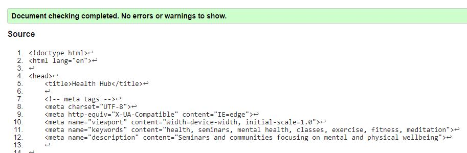
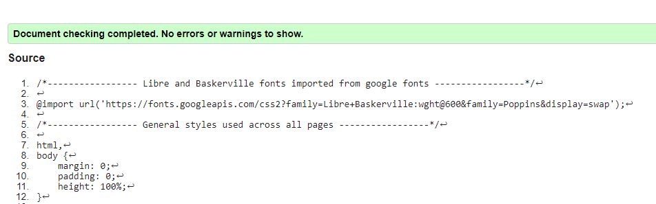
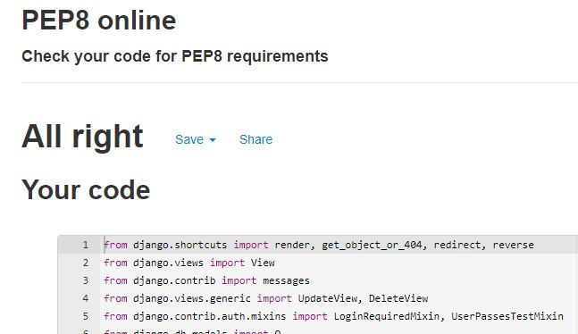

## Manual Testing

**Authentication**

Ensure a user can sign up to the website

Steps:

1. Navigate to [Health Hub](https://wellness-site.herokuapp.com/) and click Sign up
2. Enter email, username and password 
3. Click Sign up

Expected:

An email is sent with a link to sign up, upon clicking the link, registration is successful

Actual: 

An email is sent with a link to sign up, upon clicking the link, registration is successful

Ensure a user can log in once signed up

Steps:
1. Navigate to [Health Hub](https://wellness-site.herokuapp.com/)
2. Enter login details created in previous test case
3. Click login

Expected:

User is successfully logged in and redirected to the home page

Actual:

User is successfully logged in and redirected to the home page

Ensure a user can sign out

Steps:

1. Login to the website
2. Click the logout button
3. Click confirm on the confirm logout page

Expected:

User is logged out

Actual:

User is logged out

**Joining Newsletter**

Ensure a user can sign up to the newsletter

Steps:

1. Navigate to [Health Hub](https://wellness-site.herokuapp.com/) and click the newsletter invite at the top of the page
2. Enter email and name
3. Click Submit

Expected:

The user is registered to the newsletter model and success toast is shown to confirm they are registered

Actual: 

The user is registered to the newsletter model and success toast is shown to confirm they are registered

**Click to attend Event**

Steps:

1. Login to the website
2. Navigate to any seminar detail page or the seminars page 
3. click the button to attend an event

Expected:

The user is registered to the seminar model and success toast is shown to confirm they have clicked to attend

Actual: 

The user is registered to the seminar model and success toast is shown to confirm they have clicked to attend

**Click to cancel spot at Event**

Steps:

1. Login to the website
2. Navigate to any seminar detail page or the seminars page 
3. click the button to cancel your spot at an event

Expected:

The user is removed to the seminar model and success toast is shown to confirm they have cancelled their spot

Actual: 

The user is removed to the seminar model and success toast is shown to confirm they have cancelled their spot

**Submit a contact**

1. Login to the website
2. Navigate to the contact page
3. Complete the form with both a subject and body
4. Click submit

Expected:

The contact is saved to the contact model and success toast is shown to confirm they have submitted a contact

Actual: 

The contact is saved to the contact model and success toast is shown to confirm they have submitted a contact

**Create a comment**

1. Login to the website
2. Navigate to any seminar details page
3. Type a comment in the box
4. Click submit

Expected:

The comment is saved to the comment model, the comment is visible on the page and success toast is shown to confirm they have submitted a contact

Actual: 

The comment is saved to the comment model, the comment is visible on the page and success toast is shown to confirm they have submitted a contact

**Edit a comment**

1. Login to the website
2. Navigate to the same seminar details page as previous test
3. Click button to edit comment you previously submitted
4. Edit comment on comment_edit page
5. Click submit

Expected:

The comment is editted in the comment model, the edit comment is visible on the page and success toast is shown to confirm they have editted a contact

Actual: 

The comment is editted in the comment model, the edit comment is visible on the page and success toast is shown to confirm they have editted a contact

**Delete a comment**

1. Login to the website
2. Navigate to the same seminar details page as previous test
3. Click button to delete comment you previously submitted
4. Confirm you wish to delete comment on confirmation page

Expected:

The comment is deleted from the comment model, the comment is no longer visible on the page and toast is shown to confirm they have deleted a contact

Actual: 

The comment is deleted from the comment model, the comment is no longer visible on the page and toast is shown to confirm they have deleted a contact

**Submit details for donation**

1. Login to the website
2. Navigate to the donations page
3. Select which seminar you would like to support
4. Enter the amount you would like to donate
4. Click button to go to checkout

Expected:

The donation is saved on the database and the user is directed to the checkout.

Actual: 

The donation is saved on the database and the user is directed to the checkout.

**Checkout**

1. Login to the website
2. Navigate to the donations page
3. Select which seminar you would like to support
4. Enter the amount you would like to donate
4. Click button to go to checkout
5. Enter card details
6. Click submit

Expected:

The payment is submitted to Stripe and once it is successful you are directed back to the homepage with toast to confirm donation submitted

Actual: 

The payment is submitted to Stripe and once it is successful you are directed back to the homepage with toast to confirm donation submitted

**Search Bar**

1. Select any seminar and copy any word from the title
2. Copy the word into the search bar
3. Click submit
4. Repeat steps 1 - 3 with words from summary section and details section

Expected:

The seminars page is loaded with the seminar you copied the word from visible in the for loop.

Actual: 

The seminars page is loaded with the seminar you copied the word from visible in the for loop.

**Navigation Links**

Testing was performed to ensure all navigation links on the respective pages, navigated to the correct pages as per design. This was done by clicking on the navigation links on each page.

**Footer**

Testing was performed on the footer links by clicking the font awesome icons and ensuring that the social media icons opened the relevant tab in a new tab. These behaved as expected.

## Validator Testing

All pages were run through the [w3 HTML Validator](https://validator.w3.org/). Initially there were some errors due to button tags being nested in anchor tags but this has since been rectified. An error occurs on the seminar details page but this is caused by the code automatically generated by forms.py to create the text areas for the reply fields which is not something that I can rectify.

Due to the django templating language code used in the HTML files, these could not be copy and pasted into the validator and due to the secured views, pages with login required or a secured view cannot be validated by direct URI. To test the validation on the files, open the page to validate, right click and view page source. Paste the raw html code into the validator as this will be only the HTML rendered code.

All pages were run through the official [Pep8](http://pep8online.com/) validator to ensure all code was pep8 compliant. Some errors were shown due to blank spacing and lines too long. All of these errors were resolved and code passed through validators with the exception of the settings.py file and urls.py.

JavaScript code was run through [JSHINT](https://jshint.com) javascript validator.

## Responsiveness

All pages were tested to ensure responsiveness on screen sizes from 320px and upwards.

Steps to test:

- Open browser and navigate to [Health Hub](https://wellness-site.herokuapp.com/)
- Open the developer tools (right click and inspect)
- Set to responsive and decrease width to 320px
- Set the zoom to 50%
-  Click and drag the responsive window to maximum width

Expected:

Website is responsive on all screen sizes and no images are pixelated or stretched. No horizontal scroll is present. No elements overlap.

Actual:

Website behaved as expected.

## Unresolved Issues

The donation model was created with a lowercase d which does not conform to PascalCase. This was located too late to be rectified in time for submission.
